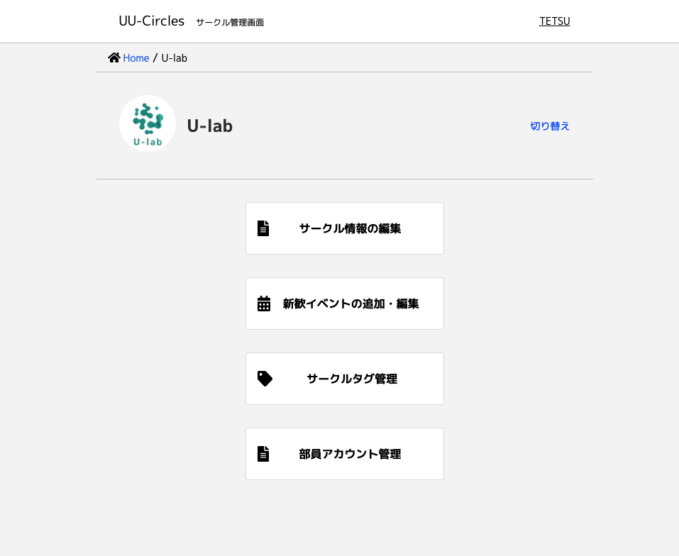

U-lab として[UU-Circles](https://uu-circles.com/)が技育展に登壇することが決まり、そこで用いるために UU-Circles を紹介する動画の制作を行いました。U-lab として動画制作を行うのは初の試みでした 👀！

登壇についての記事はこちら ↓

[【技育展】UU-Circles が登壇しました](https://ulab-uu.com/2021/09/22/uu-circles-geek-ten-2021/)

## UU-Circles 紹介動画

https://youtu.be/f\_YOvzGCe3w

この動画では、UU-Circles がこだわったポイントについて、大きく分けて 3 つ紹介されています。これについて掘り下げていきます！

## Point1 圧倒的『ビラ』一覧

トップページには各サークルのビラがランダムに表示されています。

これは従来のビラ配りのように、渡された瞬間までどんなサークルかわからないというワクワクの体験をサイト上でも再現できるようにするためです。これによってコロナ禍のサークル選びが楽しくなったのではないでしょうか！

さらに詳細ページへ進むと、各サークルの活動写真や基本情報、アピールポイント、SNS などが掲載されていてとても便利です。

[UU-Circles ビラ一覧](https://uu-circles.com/)

UU-Circles トップ画面

## Point2 運命的『今日の新歓』

トップページからは「今日の新歓」ページに行くことができます。ここではその名の通り、ページを見た当日に行われる新入生歓迎イベントが、リアルタイムに一覧で表示されます。

行きたいサークルのイベントを探すことも、イベントの開催場所に行きたいお店があるかで探すこともできるかもしれません！（⚠️ 感染症対策はしっかりと！）

[UU-Circles 今日の新歓](https://uu-circles.com/circle/newjoy)

UU-Circles 今日の新歓ページ

## Point3 機能的『管理ページ』

ここは見たことのない人のほうが多いと思います。

サークルの管理者が、UU-Circles に掲載する情報を編集することのできるページです。こう聞くと難しそうに聞こえるかもしれませんが、その印象を覆すため UI(User Interface：デザイン性・操作性)や UX(User eXperience：すべての顧客体験)にこだわりました。

このページでは、Web サイトのフォームに入力することで、いつでもどこからでも簡単に新歓日程の追加・情報の更新を行うことができます。

UU-Circles サークル管理画面

## 動画制作について

ここからは UU-Circles についてではなく、今回の紹介動画制作について書いていこうと思います。

今回私 TETSU が「どうせ動画作るなら超ハイクオリティなもの作りませんか！」と先輩方にお話したのがきっかけで紹介動画を制作するに至りました。

少し難しかったり機材についての話・TETSU の個人的な考えについての話が多くなることをお許しください！

### 今回の機材！

- Camera: Sony NEX-7
- Lens: Olympus オールドレンズ 50mm F1.8
- Mic: M-audio UBER Mic
- PC: MacBook Air 2020 16GB/1TB
- Sub: iPad Air4
- App: Final Cut Pro / Adobe illustrator / Adobe Lightroom / Notion / GoodNotes5

カメラはずいぶん古いものです。貯金が増えたらぜひいいカメラとレンズがほしいですね…。

### 撮影について

今回は目標が「超ハイクオリティな紹介動画」だったため、かなりガチガチにどんなシーンが何秒必要か考えて撮影に臨みました。下の写真のように絵コンテを作成し、時間もきっちり決めてあります。

iPad の GoodNotes5 で絵コンテを作成

この決めた時間を守るため、当日は MacBook と iPad の二台体制で挑みました。

MacBook から SideCar という機能で iPad にも同じ画面を表示させ、MacBook を撮影者(TETSU)、iPad をモデルの見えるところに置きました。そこで撮影開始時に MacBook でストップウォッチを流すことで、時間の認識を持ちつつ進めることができました。

### 編集について

この動画は編集がすごく大変でした…。今回が初の動画編集だったため、学びながらの即アウトプットでした（余談ですが TETSU のだいすきなワードは「即インプット&アウトプット」です！）。

必要な部分は残しつつ、決められた時間まで短くしていくという作業はすごく頭を使います。ですがその甲斐もあり、綺麗にまとまったのではないかと自負しています！

Final Cut Pro での編集画面

### ナレーションについて

「超ハイクオリティな紹介動画」のために、ナレーションもお願いしました。

防音室に入り、マイクをセット。原稿は準備していましたが、当日動画に合わせてみて適宜変更しました。すべてのことにおいて、決めたことをただこなすのではなく、少しの違和感・後悔を残さないよう考えて行動するのが大事だなと思い日々過ごしています！

結果、動画にピッタリ合う素晴らしいナレーションに仕上がりました！

このようにしてたくさんの方が使っているサイト「UU-Circles」についての紹介動画が作成できました。

自分が関わることができて、たくさんの方に関わって頂けて、すごく幸せでした。ありがとうございました！

## まとめ

新型コロナウィルスが蔓延したことによって開発された UU-Circles、これはもう今を生きる私達には必須のサイトになったのではないでしょうか。

いままで分散していた情報が一つにまとまり、こだわられた UI や UX によって、また新歓などの気になる情報によって何度でも確認したくなる。このようなサイトがあるのは幸せなことだといちユーザーとして感じました。

ぜひ皆さんも来年もそれ以降も、「見る側」から「発信する側」へ立場が変化しても、使い続けていただけると嬉しいです！

## 「UU-Circles 紹介動画」制作

新しい未来を作る学生団体 U-lab

Product Manager: Kazuma Iizumi  
Engineering Manager: Koya Higuchi  
Designer: Mayo Nozawa  
Camera Operator / Editor: Ittetsu Takaki  
Cast: Moe Kubota  
Writer: Riko Fujikura  
Narrator: Kurumi Iijima
